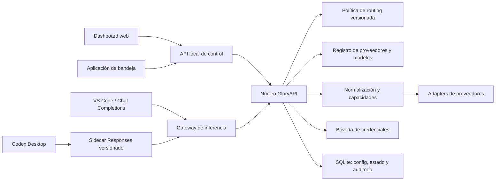

# Plan maestro: migración de FreeLLMAPI a GloryAPI

> Fecha: 2026-08-10
> Estado: EN EJECUCIÓN — Fases 0–3 y 5–9 local verificadas; el baseline tiene `HEAD` propio y gate coordinado PASS. Fase 10 tiene contratos/readiness, capabilities v2 y lifecycle fail-closed determinista verificados, mientras Fase 4, E2E Desktop, bandeja y canary/cutover operativo siguen abiertos
> Alcance de este documento: repositorio, secretos, gate, limpieza funcional,
> arquitectura, compatibilidad, configuración, ordenamiento y aplicación de bandeja.

## Resultado buscado

Construir un producto propio llamado **GloryAPI** en un workspace hermano e
independiente, usando FreeLLMAPI como baseline sin modificar su instalación
operativa. GloryAPI tendrá solo tres modelos activos, credenciales recuperables
sin guardarlas en texto plano, configuración administrable, orden manual fiable
con guardado automático, compatibilidad observable entre clientes y un control
compacto desde la bandeja de Windows.

El gate de Sentinel será obligatorio desde el inicio del rediseño. Ninguna fase
se considerará cerrada con fallos válidos de Sentinel, errores de herramienta,
tests rotos o hallazgos de seguridad sin resolver.

## Estado real confirmado

- El remoto `origin` apunta a
  `https://github.com/tashfeenahmed/freellmapi.git`; todavía no existe el remoto
  personal `gloryapi`.
- La rama local tiene historia y cambios sin confirmar que deben preservarse; no
  se debe borrar, reiniciar ni publicar el checkout como está.
- `freellmapi` debe continuar disponible como instalación operativa durante todo
  el rediseño. No se renombrará, moverá ni convertirá en el workspace de GloryAPI;
  sus clientes, puertos, datos y bridge actuales permanecerán intactos hasta un
  cutover posterior, explícito y reversible.
- El workspace reservado para la versión nueva es
  `C:\Users\Owner\OneDrive\Documentos\area-trabajo\gloryapi`. Fue creado vacío el
  2026-08-10 y después se pobló mediante el bootstrap sanitizado y overlay allowlisted;
  mantiene Git, datos, configuración y runtime separados. FreeLLMAPI no se modifica.
- La base local contiene 226 modelos, 186 habilitados, 22 credenciales y 20
  plataformas con credenciales. No se inspeccionó ni se registró el valor de
  ninguna API.
- Las credenciales se cifran con AES-256-GCM, pero la clave maestra puede residir
  en la misma base SQLite. Además se comprobaron utilidades locales ignoradas bajo
  `server/data/` que imprimen la clave maestra o credenciales descifradas. Esto no
  es una separación segura de secretos.
- La fuente de proveedores está repetida entre el tipo compartido, el allowlist
  del servidor, el registro de adapters y la lista del cliente.
- El catálogo se reconstruye mediante 35 migraciones acumulativas y contiene
  rankings, presupuestos y proveedores obsoletos.
- El servidor se enlaza actualmente a `0.0.0.0`; el rediseño debe usar loopback
  por defecto y tratar cualquier exposición LAN como una opción sensible.
- El orden guardado y el orden efectivo son conceptos distintos: las penalidades
  dinámicas pueden cambiar el orden de enrutamiento, mientras la UI guarda una
  sustitución completa solo al pulsar `Save order`.
- Existen `Playground`, `Monthly token budget` y tres endpoints de ordenamiento
  automático que ya no pertenecen al producto deseado.
- Sentinel 0.7.0 está fijado en GloryAPI con política, lock, herramientas y gate
  de proyecto. Compile y suite del checkout externo pasaron, el análisis/stage local
  está limpio y `quality:doctor` devuelve `ready: true`; el gate coordinado `GLORY-BASELINE`
  ya pasa contra el `HEAD` propio `613175e`.
- VS Code funciona contra la superficie Chat Completions de FreeLLMAPI sin
  necesitar reconstruir el protocolo Responses. Codex Desktop, en cambio, usa
  un provider personalizado `wire_api = "responses"`; el bridge actual traduce
  requests, streaming SSE, reasoning y tools entre dos contratos distintos.
- El bridge canónico es `integrations/codex-bridge/bridge/server.js`; las rutas de
  `.codex` son enlaces o configuración operativa, no otra copia que deba editarse.
  Es un único archivo de más de 2.000 líneas que también contiene búsqueda web,
  visión, caches, compatibilidad de tools, logging y servidor HTTP.
- El bridge ya incorpora defensas útiles —loopback, límites de body, stop seguro,
  health con identidad y ausencia de CORS—, pero su cobertura automatizada actual
  no demuestra todavía la compatibilidad completa de Codex Desktop.
- 2026-08-10: el 429 con tools en andoryyu quedó diagnosticado y resuelto en el
  worker desplegado (v1.7.1, deploy `9ce63a1a`): no era cuota agotada, sino
  downgrade por `foreign_toolset` (tools sin la firma oficial de codebuff →
  `ling-3.0-tiny:free`). El fix `end_turn` inyectado pasa la firma;
  `deepseek-v4-flash` es ilimitado. La cadena completa vía freellmapi devuelve 200
  con tools. Este incidente entra como fixture de entrada de Fase 9, no como
  bloqueo del plan.

### Catálogo final requerido

| Orden inicial | Proveedor | ID de modelo | Nombre visible |
| ---: | --- | --- | --- |
| 1 | `andoryyu` | `deepseek-v4-flash` | DeepSeek V4 Flash (Andoryyu) |
| 2 | `opencode-zen` | `deepseek-v4-flash-free` | DeepSeek V4 Flash (Zen) |
| 3 | `opencode-go` | `deepseek-v4-flash` | DeepSeek V4 Flash (Go) |

Estos son los tres modelos visibles en la captura aportada. La migración debe
terminar con exactamente tres filas en el catálogo operativo; conservar las APIs
de otros proveedores no implica conservar sus modelos ni activarlos.

## Decisiones de producto y arquitectura

1. **Coexistencia obligatoria.** `freellmapi` será el sistema legado operativo y
   `gloryapi` un workspace hermano aislado. No compartirán Git metadata, bases,
   WAL, directorios de datos, puertos, PID, logs, configuración activa ni bridge.
2. **GloryAPI será un repositorio nuevo**, no un push accidental al upstream.
   Se conservarán licencia y atribución. Publicar la historia Git completa solo
   será posible si su escaneo demuestra que no contiene secretos; si no, se usará
   una historia nueva a partir del árbol sanitizado, sin reescribir el producto
   desde cero ni ocultar su procedencia.
3. **La base será una derivación controlada.** Se partirá de un commit local y se
   aplicará un overlay allowlisted de cambios necesarios, con path, hash, motivo y
   escaneo. Se rechazan tanto la copia cruda de la carpeta como una reimplementación
   desde cero.
4. **Catálogo y credenciales son dominios distintos.** El catálogo tendrá tres
   modelos; la bóveda conservará las 22 credenciales actuales como registros
   activos o archivados para poder registrar proveedores nuevamente.
5. **Una sola fuente de proveedores y modelos.** El backend publicará el registro
   canónico y la UI lo consumirá. No habrá cuatro listas manuales que sincronizar.
6. **El orden del usuario es estable.** La salud, el cooldown o un fallo pueden
   hacer que una petición salte temporalmente al siguiente modelo, pero nunca
   reescribirán ni reordenarán silenciosamente la preferencia persistida.
7. **Guardado automático observable.** Reordenar o activar/desactivar produce una
   transacción inmediata, con estados `guardando`, `guardado` y `error`, control de
   revisión y reconciliación con la respuesta del servidor.
8. **Configurable no significa ejecutar código arbitrario.** Endpoints, timeouts,
   límites y políticas serán datos validados. Transformaciones especiales se
   expresarán mediante capacidades declarativas; un adapter nuevo que requiera
   código seguirá necesitando implementación y tests.
9. **El cliente no decide el routing.** Dashboard, bridge y aplicación de bandeja
   consumirán el mismo servicio de control y el mismo motor de routing.
10. **La compatibilidad se prueba por contrato.** “OpenAI-compatible” no se tratará
   como una garantía total; cada proveedor/modelo declarará y demostrará sus
   capacidades.
11. **Codex tendrá un adaptador aislado y versionado.** El bridge se reconstruirá
   como sidecar modular de Responses que consume GloryAPI, con ciclo de vida y
   rollback propios. No se integrarán hacks de Codex en el router central ni se
   tocará la ruta directa de VS Code.
12. **Un shim observado no es un contrato.** Cada excepción para DeepSeek, una
    versión de Codex o una tool tendrá fixture sanitizado, versión afectada,
    motivo, propietario y condición de retirada.

## Arquitectura objetivo



### Responsabilidades

- `ProviderRegistry`: identidad, auth, endpoint, modelos, capacidades y estado;
  no conoce el orden de fallback.
- `CredentialVault`: crea, resuelve, exporta e importa referencias secretas; no
  expone valores en listados, logs o respuestas normales.
- `RoutingPolicy`: conserva el orden manual, activación y revisión; no contiene
  detalles HTTP del proveedor.
- `CompatibilityAdapter`: normaliza request/response/stream y clasifica errores;
  no decide qué modelo viene después.
- `Router`: aplica una política acotada de intentos, salud y fallback, generando
  una traza sanitizada de cada decisión.
- `SettingsService`: valida tipos, rangos, defaults y cambios que exigen reinicio.
- `Control API`: mutaciones administrativas locales con concurrencia optimista y
  eventos de cambio para web y bandeja.
- `CodexResponsesAdapter`: traduce exclusivamente Responses ↔ contrato canónico,
  valida el ciclo SSE y de tools y declara sus límites; no guarda credenciales de
  proveedores ni decide routing.

No se extraerá un framework o núcleo externo a GloryAPI durante este rediseño.
Primero se crearán límites internos y contratos consumidos por dashboard, bridge y
bandeja; una librería separada solo se justificaría con un segundo producto real.

## Investigación del bridge y límites del diagnóstico

### Hechos confirmados

- La [referencia oficial de configuración de Codex](https://developers.openai.com/codex/config-reference/)
  indica que los providers personalizados usan actualmente Responses; `wire_api`
  solo admite `responses`. También documenta retries HTTP/stream, timeout de
  inactividad, WebSockets, `env_key` y autenticación por comando.
- La misma referencia desaconseja `experimental_bearer_token`. El perfil local del
  bridge todavía lo usa, por lo que debe migrar a un comando que obtenga un token
  efímero desde la bóveda protegida o, como transición, a una variable de entorno.
- El bridge actual fuerza un modelo, adapta mensajes e items de Responses a Chat
  Completions, reconstruye tools y razonamiento, y vuelve a emitir la secuencia SSE
  esperada por Codex. También ejecuta internamente búsqueda web y una adaptación de
  visión porque el upstream no ofrece equivalentes nativos completos.
- Varias reglas son correcciones empíricas: promover determinados mensajes,
  restaurar `reasoning_content`, mantener adyacencia tool-call/tool-result,
  reparar nombres de namespaces y emitir campos especiales para colaboración.
  Estas reglas explican por qué el bridge funciona, pero también lo acoplan a
  comportamientos concretos del modelo, las tools y la versión del cliente.
- Las pruebas locales cubren health, auth, tamaño de body, seguridad básica, stop,
  búsqueda web interna y algunos timeouts. No cubren aún la matriz completa de
  Responses, tools, imágenes, cancelación, streams truncados, procesos o upgrades.

### Interpretación de arquitectura

VS Code funciona con menos fricción porque su ruta observada consume el protocolo
que GloryAPI ya expone. Codex Desktop añade otra semántica: items tipados,
reasoning, tools normales y custom, namespaces, descubrimiento diferido, eventos
SSE y servicios administrados por la aplicación. Chat Completions no representa
todos esos estados de forma equivalente; el bridge debe conservar o reconstruir
información que se perdería en una traducción ingenua.

Por eso el problema no es simplemente “cambiar el formato JSON”. La fragilidad
proviene de mezclar en un archivo transporte, traducción, quirks del modelo,
estado, web, visión y lifecycle, y de tratar observaciones de una versión como si
fueran contratos estables. La solución planificada es aislar, tipar, versionar y
probar esos límites, no retirar a ciegas las correcciones que hoy permiten operar.

### Incertidumbres que requieren laboratorio real

- El comportamiento exacto de una respuesta que solo contiene tool calls y deja
  `last_agent_message` vacío: primero se debe comprobar el lifecycle esperado por
  Codex; no se inyectará texto artificial sin esa evidencia.
- Qué tools, campos privados o esquemas cambian entre la versión actual de Codex
  Desktop, una actualización y distintos plugins.
- Si reasoning sintético sigue siendo necesario para cada uno de los tres modelos
  o si oculta una incompatibilidad que debe resolverse en el adapter del provider.
- Qué funciones de imagen, browser, computer use, MCP, automatización y multiagente
  pueden preservar semántica completa y cuáles deben declararse no soportadas.
- La prueba E2E real de Desktop permanece pendiente mientras el modo bridge está
  desactivado. Hasta ejecutarla, el diagnóstico es explicado respecto de la causa
  y parcial respecto de la compatibilidad completa.

## Estrategia de workspace paralelo

| Alternativa | Ventaja aparente | Riesgo dominante | Decisión |
| --- | --- | --- | --- |
| Rehacer desde cero | árbol inicialmente limpio | pierde comportamiento, tests, fixes y casos límite ya aprendidos | Rechazada |
| Copiar toda `freellmapi` | conserva el estado visible rápidamente | duplica secretos, runtime, `.git`, datos, enlaces y deuda sin trazabilidad | Rechazada |
| Derivación controlada | conserva historia/código útil y hace auditable cada diferencia | exige inventario y overlay inicial | Elegida |

La carpeta
`C:\Users\Owner\OneDrive\Documentos\area-trabajo\gloryapi` ya está reservada y
vacía. La derivación controlada la poblará desde un commit local de referencia,
sin hardlinks ni Git metadata compartida, y aplicará después un overlay explícito
de cambios tracked/untracked necesarios. El overlay tendrá un manifiesto
sanitizado con path, hash, origen, motivo y resultado del secret scan.

Se excluirán por defecto `.git`, `.env*`, `server/data/**`, `*.db*`, `*.log`, WAL,
SHM, dumps, backups, `node_modules`, builds, caches, PID y cualquier symlink,
junction o reparse point. Una excepción requerirá justificación y comprobación
específica. Las dependencias se regenerarán desde el lock.

FreeLLMAPI seguirá siendo la fuente operativa hasta el cutover. Los arreglos
críticos que necesite mientras GloryAPI se construye se registrarán en el
manifiesto y se portarán deliberadamente; no habrá sincronización bidireccional
automática ni dos procesos escribiendo la misma base.

## No objetivos

- No mantener el enorme catálogo de modelos gratuitos del upstream.
- No volver a introducir rankings o presupuestos como orden automático.
- No permitir JavaScript, plantillas de shell ni transformaciones libres desde la
  pestaña de configuración.
- No publicar, desplegar ni escribir en GitHub durante esta tarea de planificación.
- No prometer compatibilidad con un proveedor sin fixture o prueba de contrato.
- No convertir la bandeja en un segundo servidor ni duplicar el motor de routing.
- No renombrar, mover, borrar ni usar la carpeta `freellmapi` como workspace del
  rediseño mientras sea la instalación operativa.
- No compartir SQLite/WAL, `.env`, puertos, PID, logs, bridge, junctions ni
  configuración activa de clientes entre FreeLLMAPI y GloryAPI.
- No empezar el producto desde cero ni crear GloryAPI mediante una copia recursiva
  indiscriminada de la carpeta actual.

## Plan de ejecución

### Fase 0 — Congelar y proteger el punto de partida

Objetivo: asegurar que la migración no pierda cambios, credenciales ni evidencia,
y declarar FreeLLMAPI como instalación legado operativa durante el desarrollo.

- [x] Registrar rama, HEAD, remotos, estado Git y lista exacta de archivos
  modificados/no rastreados sin copiar secretos al informe.
- [x] Registrar health, puertos, procesos, data dir, PID, bridge/junctions y clientes
  que dependen de FreeLLMAPI. Este mapa será la prueba de que siguen intactos.
- [x] Confirmar que `.env`, SQLite, WAL, logs y exportaciones de credenciales están
  ignorados y no aparecen en el índice ni en la historia que se publicará.
- [x] Implementar y probar un backup consistente mediante la API de backup de SQLite. La prueba de restauración
  cubre 22/22 credenciales sintéticas; el snapshot real del legado requiere todavía una ventana controlada.
- [x] Generar un inventario sanitizado: proveedor, etiqueta, fingerprint, estado y
  fecha; nunca el valor de la API.
- [x] Generar el manifiesto preliminar de overlay para todos los cambios tracked y
  untracked que puedan pertenecer a GloryAPI, incluidos bridge y scripts. Cada
  entrada tendrá path, hash, motivo y clasificación `incluir`, `recrear` o `excluir`.
- [x] Escanear secretos tanto en el historial candidato como en el overlay. La
  decisión de publicar historia completa o crear una historia sanitizada atribuida
  se tomó con esa evidencia, no por preferencia estética. El overlay y los 518
  commits/4.018 blobs del historial candidato se revisaron sin registrar valores;
  las coincidencias quedaron limitadas a fixtures sintéticos de tests y los
  artefactos sensibles ya identificados en el manifiesto permanecen excluidos.
  El historial no se reutiliza como bootstrap publicable: GloryAPI conserva el
  árbol sanitizado y su procedencia mediante `git archive` + overlay.
- [x] Definir la convención documental del nuevo proyecto antes de crear
  `roadmap.md` o `Agente/`; el checkout actual no declara esas fuentes canónicas.
- [x] Prohibir cualquier poda hasta completar la prueba de restauración sintética 22/22; queda bloqueada la poda
  real hasta generar y verificar el snapshot del legado.
- [x] Declarar una política de cambios del legado: solo correcciones operativas
  necesarias, registradas y evaluadas para portarlas; sin desarrollo paralelo
  silencioso ni sincronización bidireccional automática. GloryAPI no modifica
  `freellmapi`; cualquier excepción futura debe registrar path, motivo, evidencia,
  pruebas, impacto y decisión de portabilidad antes de aplicarse.

Salida: manifiesto sanitizado, mapa operativo y backup recuperable fuera del
repositorio, con FreeLLMAPI todavía funcionando igual que al inicio.

### Fase 1 — Derivar el workspace aislado y crear la identidad GloryAPI

Objetivo: crear GloryAPI al lado de FreeLLMAPI, reproducible y aislada, y eliminar
el riesgo de publicar en el repositorio original.

- [x] Reservar vacía la carpeta hermana
  `C:\Users\Owner\OneDrive\Documentos\area-trabajo\gloryapi`, sin inicializar Git,
  copiar archivos ni cambiar ningún consumidor. La derivación controlada posterior
  ya inicializó Git y aplicó el overlay en esa carpeta.
- [x] Elegir el bootstrap únicamente con el resultado del escaneo histórico:
  el historial candidato se trató como no publicable por los artefactos sensibles
  identificados en el inventario, así que se exportó el árbol sanitizado con
  `git archive`, se inició un Git nuevo y se conservó licencia/procedencia. El
  overlay allowlisted se aplicó después; no se copiaron `.git`, worktrees,
  alternates ni hardlinks compartidos.
- [x] Ejecutar un guard de independencia antes de editar: `.git` y
  `git rev-parse --git-common-dir` resuelven dentro de `gloryapi`; no existe
  `.git/objects/info/alternates`, el `.git` local no es symlink y no hay remoto
  configurado. El árbol legado queda fuera del workspace y no se modifica.
- [ ] Retirar inmediatamente cualquier remoto heredado del nuevo checkout. Antes
  de crear un destino externo, los comandos de push deben fallar de forma segura.
- [x] Aplicar solo el overlay allowlisted. No copiar recursivamente la carpeta y no
  seguir symlinks/junctions; comprobar hash, destino y secret scan de cada entrada.
- [x] Regenerar dependencias desde manifests/lock y recrear artefactos generados;
  no transferir `node_modules`, builds, caches o temporales.
- [ ] Preservar licencia y atribución. Si el historial completo pasa el escaneo,
  podrá conservarse; si no, crear una historia nueva desde el árbol sanitizado con
  procedencia documentada. En ambos casos el código base y sus pruebas se importan.
- [ ] Crear un repositorio externo nuevo y vacío llamado `gloryapi` solo después
  del baseline local y el escaneo. Esta escritura externa requerirá autorización
  explícita al ejecutarla.
- [ ] Añadir como `origin` únicamente ese repositorio y declarar la rama primaria
  real, sin asumir que se llama `main`; nunca publicar desde `freellmapi`.
- [x] Renombrar, en un cambio separado, paquetes `@freellmapi/*`, marca, textos,
  prefijos de claves internas, nombres de base y documentación a `gloryapi`.
- [x] Asignar a GloryAPI puertos, directorio de datos, logs, PID, token local, perfiles de prueba y bridge propios. Verificar que no abre ningún archivo de runtime de FreeLLMAPI ni colisiona con sus procesos.
- [x] Mantener bridge, junction `.codex\bridge`, scripts de modo, provider en
  `config.toml`, VS Code y accesos directos actuales apuntando a FreeLLMAPI. La
  migración de consumidores queda reservada al canary/cutover de la Fase 12.
- [ ] Mantener temporalmente redirects o aliases internos solo donde una migración
  de datos los necesite; eliminarlos al cerrar la fase.

Mapa de aislamiento obligatorio:

| Recurso | FreeLLMAPI operativo | GloryAPI en construcción | Regla |
| --- | --- | --- | --- |
| Raíz | `area-trabajo\freellmapi` | `area-trabajo\gloryapi` | nunca renombrar ni superponer |
| Git/remotos | estado actual protegido | metadata y futuro `origin` propios | sin worktree/hardlinks/remoto de push compartido |
| Datos/SQLite | base, WAL y backups actuales | data dir y base temporales propias | jamás abrir la misma DB desde ambos |
| Puertos/procesos | puertos y PID actuales | puertos y namespace de PID distintos | preflight de colisión e identidad |
| Credenciales | fuente operativa hasta cutover | vault migrada en entorno aislado | sin dual-write; delta final por fingerprint/revisión |
| Logs/config | rutas y config actuales | rutas, token y config de prueba propios | sin `.env` ni logs compartidos |
| Bridge/Codex | junction y scripts actuales | sidecar/perfil temporal | no repuntar el perfil principal antes del canary |
| VS Code | conexión actual | perfil de smoke explícito | baseline vigente hasta cutover |

Aceptación:

- FreeLLMAPI conserva el mismo health, clientes y rutas operativas registrados en
  Fase 0 mientras GloryAPI puede arrancar y detenerse de manera independiente.
- GloryAPI puede borrarse y recrearse desde commit + manifiesto de overlay sin
  escribir en FreeLLMAPI.
- No comparten `.git`, DB/WAL, data dir, `.env`, puertos, PID, logs, bridge,
  junctions ni configuración activa.
- `git remote -v` no muestra el upstream como destino de push.
- `origin` apunta exclusivamente a `gloryapi`.
- El nuevo repositorio no contiene `.env`, bases, WAL, logs ni secretos.
- Build y pruebas del baseline importado pasan antes de iniciar el rediseño.

### Fase 2 — Migrar y respaldar las APIs de forma segura

Objetivo: conservar las 22 credenciales actuales sin depender de la base vieja ni
de scripts que imprimen secretos.

- [x] Migrar desde un snapshot/export versionado de FreeLLMAPI, nunca abriendo su
  SQLite viva desde el proceso GloryAPI. El snapshot externo fue verificado y el
  importador específico `server/src/lib/credential-import.ts` migró 22/22 filas
  sin registrar valores; no se creó un framework genérico de migraciones.
- [x] Introducir una interfaz `CredentialVault` cuyo primer adapter usa Windows
  DPAPI con alcance `CurrentUser`. Las altas nuevas ya persisten ciphertext DPAPI
  opaco, fingerprint y metadatos en SQLite; el contrato y el adapter fail-closed
  prueban round-trip e integridad en Windows. Las filas AES heredadas solo tienen
  un lector transicional para un snapshot aislado y deben migrarse antes de activar
  datos operativos. Copiar la base a otra cuenta no desbloquea secretos DPAPI.
- [x] Diseñar un bundle portable versionado: `server/src/lib/vault-bundle.ts`
  cifra el payload con AES-256-GCM y deriva la clave mediante Argon2id con salt y
  parámetros incluidos en el envelope. El secreto y la frase nunca se escriben en
  logs ni dentro del repositorio; el módulo exige soporte Argon2id del runtime y
  rechaza versiones/parámetros desconocidos.
- [ ] Crear el bundle con ACL restringida al usuario actual y documentar los casos
  de cambio de cuenta/equipo, rotación, frase perdida y perfil Windows perdido. El
  bundle + frase es la vía de migración entre perfiles; perder ambos es
  irrecuperable y la UI debe advertirlo antes de podar la base antigua.
- [ ] Migrar una credencial piloto, verificar lectura y health check, y luego migrar
  las restantes de forma transaccional e idempotente.
- [ ] Conservar como archivadas las APIs de proveedores sin modelo activo. La UI
  debe permitir consultar proveedor, etiqueta, fingerprint y estado, e importar o
  reactivar sin volver a copiar manualmente todos los valores.
- [x] Probar exportación e importación en una base temporal limpia y comparar los 22
  fingerprints, sin imprimir valores. La prueba sintética y la migración real
  coinciden en el fingerprint-set hash `aaa2cc9254943104cbe35508e7868b978369d4dddf9e6784e69b755ad2e74819`.
- [x] Registrar revisión/fingerprint de la exportación inicial. El snapshot tiene
  SHA-256 `7e023c8d3b36938ef6f7b088ae5e667ac84daa1c00eface4e1852a42740b2041` y el
  conjunto de fingerprints quedó registrado; si una API se añade, rota o archiva
  en FreeLLMAPI durante el desarrollo, el cutover generará un delta final explícito.
  Se prohíbe mantener ambas bóvedas mediante dual-write.
- [x] Eliminar la clave maestra colocada junto a los ciphertexts solo en GloryAPI y
  después de verificar 22/22 descifrados DPAPI, integridad SQLite y fingerprint-set.
  La instalación operativa no fue alterada; el target GloryAPI ya no tiene fila
  `settings.encryption_key`. La rotación del secreto interno unificado queda
  separada del vault de proveedores.
- [x] No importar a GloryAPI las utilidades locales que imprimen claves descifradas;
  el overlay las excluye y el secret scan no encontró producción sensible. Su
  retirada del legado queda reservada para una tarea posterior al cutover.
- [ ] Definir recuperación: importar bundle → desbloquear bóveda → validar
  fingerprints → health check opt-in. Nunca ejecutar health checks externos
  durante una restauración sin indicarlo.

Aceptación:

- Las 22 credenciales se recuperan en una instalación vacía.
- El bundle se restaura bajo otro perfil Windows y vuelve a proteger cada secreto
  con el DPAPI del usuario destino.
- Una copia de SQLite por sí sola no permite descifrarlas.
- APIs y logs administrativos nunca devuelven secretos por defecto.
- Búsqueda de secretos y pruebas negativas no encuentran valores en repositorio,
  reportes, logs, snapshots ni errores.

### Fase 3 — Instalar el gate obligatorio de Sentinel

Objetivo: hacer que cada fase siguiente tenga una autoridad de cierre reproducible.

- [x] Ejecutar preflight del checkout GloryAPI y comprobar capacidades con `sentinel --help` y `sentinel doctor --json`.
- [x] Declarar la rama primaria real `gloryapi` en `sentinel.config.json`.
- [x] Incorporar `quality.config.json`, `quality-tools.json`, `sentinel.lock.json` y `scripts/quality/` adaptados al
  monorepo npm. `varsense` queda fuera hasta provisionar una versión compatible y verificable.
- [x] Fijar Sentinel 0.7.0 por commit/hash/capacidades y verificar el lock con `quality:doctor`; la fuente actual es
  el checkout hermano declarado, con evidencia compile+suita limpia y runtime local provisionado.
- [x] Declarar `npm run task:check -- <ID>` y `quality:doctor`/`quality:analyze` como interfaces canónicas del gate.
- [x] Ejecutar el gate baseline coordinado contra el primer `HEAD` propio: `npm run task:check -- GLORY-BASELINE`
  devuelve PASS. La revalidación actual reporta 0 errores y 5 warnings de mantenimiento no bloqueantes.
- [x] Clasificar y corregir los defectos válidos del baseline antes de cerrar el bootstrap; no se añadieron
  exclusiones Sentinel. Los warnings restantes son la transformación dinámica recomendada por dnd-kit y cuatro
  límites de tamaño en módulos heredados que quedan como refactorización local separada.
- [ ] Exigir gate local-light por fase y `--full`/CI al cierre del rediseño.

Política de cierre: cero `FAIL`, cero errores de herramienta y cero hallazgos
válidos pendientes. Un warning accionable también se corrige; un falso positivo
requiere fixture, justificación y regla acotada, no una exclusión amplia.

### Fase 4 — Caracterización y auditoría de arquitectura

Objetivo: entender el fallo por contrato antes de reemplazar el router.

- [ ] Capturar el flujo sanitizado de una misma conversación desde Codex
  Desktop/ChatGPT y desde VS Code: entrada, headers estructurales, streaming,
  tools, respuesta, terminación y error; nunca contenido sensible.
- [ ] Identificar por separado los consumidores reales: Codex Desktop en modo
  ChatGPT nativo, Codex Desktop mediante bridge/proveedor personalizado y las
  extensiones concretas de VS Code. No agrupar contratos distintos bajo el nombre
  genérico “ChatGPT”.
- [ ] Crear una matriz de compatibilidad por cliente y por los tres modelos:
  streaming/no streaming, tools, `tool_choice`, tools paralelas, mensajes `tool`,
  contenido por bloques, reasoning, alias de modelo, límites y cancelación.
- [ ] Reproducir el caso Andoryyu que falla en ChatGPT y funciona en VS Code con un
  fixture determinista. Comparar protocolos y payloads antes de atribuir el fallo
  al proveedor.
- [ ] Auditar responsabilidades de `proxy.ts`, `OpenAICompatProvider`, health,
  rate-limit, DB y bridge; localizar transformaciones duplicadas y estado global.
- [ ] Auditar seguridad: auth del dashboard/control API, binding de red, CORS,
  redacción, SSRF, validación de endpoints, secretos y logs de 32 MiB actuales.
- [ ] Exigir loopback por defecto y autenticación en toda la Control API. La
  exposición LAN será opt-in, advertida y probada, nunca efecto de `0.0.0.0`.
- [ ] Probar SSRF y DNS rebinding en endpoints configurables: solo `https` salvo
  modo local explícito, resolución/allowlist de host, bloqueo de rangos privados y
  límites de redirects, body y tiempo.
- [ ] Aplicar redacción estructurada a errores, trazas, SSE, métricas, backups y
  reportes del gate; no depender de reemplazos de strings posteriores.
- [ ] Auditar rendimiento con perfiles: parseo/buffering SSE, escrituras de logs,
  consultas por intento, bloqueo de SQLite y memoria por stream.
- [ ] Auditar escalabilidad y fallo parcial: concurrencia, backpressure, timeout,
  retry storm, cooldown, crash durante escritura y proveedor lento.
- [ ] Producir ADRs para registro declarativo, bóveda, routing versionado,
  compatibilidad y shell de bandeja antes de implementar esas capas.

Modelo de carga inicial que debe medirse y confirmarse:

- un usuario local, hasta tres clientes simultáneos;
- hasta 32 solicitudes en vuelo;
- tres modelos activos y hasta 100 proveedores/credenciales archivados;
- selección local p95 menor a 5 ms, autosave local p95 menor a 250 ms;
- retención acotada de logs y pruebas con al menos 1 millón de filas históricas;
- memoria acotada por stream: nunca buffer ilimitado sin spool o límite explícito.
- SQLite en WAL, `busy_timeout` definido, transacciones breves y una sola ruta de
  escritura de dominio para orden, settings y auditoría. Medir espera de la cola
  de escritura bajo 32 streams, no solo latencia de lectura.

### Fase 5 — Limpiar catálogo, schema y UI

Objetivo: reducir el producto a los tres modelos y eliminar funciones obsoletas.

- [x] Crear un schema limpio de GloryAPI y una migración explícita desde la base
  existente; las instalaciones nuevas usan directamente el schema compacto y no
  ejecutan las 35 migraciones históricas de catálogo. Las bases existentes siguen
  el camino de upgrade histórico y después se normalizan.
- [x] Migrar las tres filas objetivo y su orden 1–3; borrar del catálogo operativo
  los otros modelos y sus filas de fallback. La normalización transaccional conserva
  intactas las filas de la bóveda y registra `catalog_schema_version = glory-v1`.
- [x] Retirar del registro operativo los providers sin modelo activo después de
  conservar sus credenciales en la bóveda. En producción el registry y las altas
  nuevas de claves exponen solo el adapter genérico y las excepciones de
  Andoryyu/Zen/Go; los adapters heredados quedan aislados para pruebas/upgrades.
- [x] Eliminar `PlaygroundPage`, su navegación, rutas, imports y hook. El gateway
  `/v1/chat/completions` permanece como contrato de inferencia para clientes
  externos, no como una segunda UI dentro del dashboard.
- [x] Eliminar `Monthly token budget` de UI, tipos y rutas, y del schema operativo
  nuevo. Las migraciones históricas conservan temporalmente la columna solo como
  input de upgrade aislado y la normalización la elimina antes de activar la base.
- [x] Eliminar los presets `intelligence`, `speed` y `budget`, sus endpoints y la
  UI que los ejecutaba; el orden solo cambia mediante el contrato explícito de
  actualización de routing.
- [x] Conservar las métricas de salud, latencia y success rate solo como
  información; no pueden mutar el orden persistido.
- [x] Sustituir el nombre `Fallback` por `Routing` en la navegación y el panel
  principal, reflejando que es control de routing y no un ranking automático.

Aceptación:

- `SELECT COUNT(*) FROM models` devuelve 3.
- El orden persistido es Andoryyu, Zen y Go.
- No existen rutas/UI de Playground, presupuesto mensual ni sort presets; el
  gateway de inferencia sigue disponible para clientes API externos.
- El arranque repetido es idempotente y no repuebla modelos eliminados.
- El arranque de una base nueva usa el schema compacto; una base heredada pasa por
  upgrade y luego por la misma normalización, sin perder credenciales archivadas.

### Fase 6 — Rehacer alta de proveedores y modelos

Objetivo: poder agregar integraciones sin editar listas en cuatro archivos.

- [x] Definir esquemas versionados `ProviderDefinition`, `ModelDefinition`,
  `CapabilityProfile` y `CredentialRef` en el núcleo compartido con
  `REGISTRY_SCHEMA_VERSION = glory-registry-v1`.
- [x] Hacer que el backend sea la fuente de verdad y exponga definiciones
  sanitizadas mediante `GET /api/registry`; Keys consume ese snapshot y ya no
  mantiene una lista manual de providers. Las credenciales archivadas aparecen
  como metadatos y nunca como valores.
- [ ] Crear un asistente por pasos: proveedor → endpoint/auth → credencial →
  descubrir o registrar modelo → probar capacidades → revisar → activar.
- [ ] Permitir importar `/models` cuando exista, pero exigir selección y prueba;
  nunca activar un catálogo remoto completo automáticamente.
- [ ] Ofrecer plantillas declarativas para OpenAI Chat Completions y variantes de
  auth. Google/Cohere u otros protocolos requieren adapter propio y contract tests.
- [x] Guardar un provider nuevo primero como `draft` mediante el Control API,
  con endpoint HTTPS, adapter, auth y capacidades validados. El endpoint de
  verificación ejecuta, según el check solicitado, `validateKey` o un ping de
  chat sanitizado contra el adapter registrado; capacidades, health y chat se
  registran por separado. La activación es fail-closed: exige las tres
  verificaciones y un adapter operativo registrado; no existe activación
  implícita ni catálogo remoto automático.
- [ ] Mostrar claramente si una opción es heredada del proveedor o sobrescrita por
  el modelo.
- [ ] Añadir edición, duplicado, exportación sanitizada, desactivación y borrado con
  validación de referencias.

### Fase 7 — Pestaña de configuración detallada

Objetivo: sacar del código los knobs operativos que deben variar sin convertir
invariantes de seguridad en preferencias.

- [x] Crear un registro tipado de settings con clave, tipo, default, rango,
  descripción, alcance, sensibilidad y `requiresRestart`, versionado como
  `glory-settings-v1`.
- [x] Migrar inicialmente a configuración validada los knobs operativos de intentos
  máximos, umbral near-limit, sticky sessions, intervalo de health y cooldown del
  provider. Los límites absolutos, criptografía, validación de URL y sanitización
  permanecen en código.
- [x] Permitir por proveedor/modelo overrides declarativos para base URL HTTPS,
  alias, timeout, esquema de auth y capacidades; la API muestra el valor efectivo
  y si proviene del default, provider o modelo. La aplicación del override al
  transporte concreto queda protegida por el adapter y no ejecuta URLs inseguras.
- [x] Mantener en código algoritmo criptográfico, validación de host/URL, límites
  máximos absolutos, sanitización y reglas que impedirían una configuración
  insegura; los overrides no pueden relajar esas invariantes.
- [ ] Construir pestañas `General`, `Routing`, `Health y reintentos`, `Proveedores`,
  `Compatibilidad`, `Logs` y `Seguridad` reutilizando componentes existentes.
- [ ] Auditar primero `client/src/components`, tokens, patrones de confirmación y
  el `dnd-kit` ya instalado. Extraer la fila ordenable/vista compacta compartida
  antes de crear una variante visual exclusiva para la bandeja.
- [ ] Incluir defaults, restaurar por sección, validación inline, indicador de
  reinicio y auditoría sanitizada de cambios.
- [x] Aplicar cambios en una transacción versionada con `expectedRevision`, rechazar
  claves desconocidas o valores fuera de rango y exponer el contrato mediante
  `GET/PATCH /api/settings`.
- [x] Añadir la página `Settings` agrupada por alcance, con rangos visibles,
  indicador de reinicio y guardado autenticado con descarte local ante errores.


### Fase 8 — Ordenamiento fiable y autosave

Objetivo: que el orden visible sea exactamente el orden persistido y sobreviva a
fallos, reinicios y dos clientes abiertos.

- [x] Representar la política como lista ordenada de IDs únicos más un número de
  revisión (`glory-routing-v1`). Con tres modelos, una lista completa es más
  simple y segura que posiciones fraccionarias.
- [x] Crear un comando atómico `reorder` que valida IDs, duplicados, conjunto,
  prioridades consecutivas y `expectedRevision`, y devuelve el snapshot canónico
  con nueva revisión.
- [x] Guardar al finalizar cada drag y cada toggle; retirar `Save order` y
  `Discard` de la UI.
- [x] Usar actualización optimista con rollback visible ante conflicto/error y
  cola de la última intención mientras existe una escritura en vuelo. Una
  respuesta tardía no sobrescribe una revisión más nueva.
- [x] Mostrar `Saving…`, `Saved`, error de persistencia y revisión actual, con
  reintento de la intención encolada de forma segura.
- [x] Emitir eventos SSE locales autenticados de cambio de revisión/estado para
  sincronizar dashboard y bandeja sin polling agresivo. Las conexiones tienen
  heartbeat, limpieza al desconectar y cierre controlado durante shutdown.
- [x] Separar `orden configurado` de `modelo usado actualmente`; el snapshot de
  routing conserva la política persistida y un runtime efímero expone solo
  intentos en vuelo y el último modelo completado. Un fallback se registra como
  estado/evento, no como reordenamiento.
- [x] Probar drag/toggle con escritura en vuelo, respuesta fuera de orden, conflicto
  concurrente entre dos clientes y limpieza del estado runtime tras reinicio; la
  recuperación de red y el crash del proceso completo quedan cubiertos en la
  siguiente matriz de lifecycle del gateway/bridge.

### Fase 9 — Rehacer compatibilidad y routing

Objetivo: resolver la causa de los saltos/fallos y explicar cada decisión.

- [x] Definir un request canónico interno y un adapter puro de entrada para
  Chat Completions; la normalización de mensajes/tool calls vive en
  `toCanonicalChatRequest` y no contiene condicionales por nombre de cliente.
  Responses/Codex queda en el sidecar separado de Fase 10.
- [ ] Declarar capacidades por modelo/proveedor: mensajes soportados, tools,
  reasoning, streaming, contenido multimodal, límites y requisitos de historial.
- [x] Validar el request contra las capacidades efectivas declaradas antes de
  consumir un intento; unsupported tools/reasoning/streaming fail closed or move
  to the next compatible candidate without applying provider cooldown.
- [x] Normalizar streaming de los adapters OpenAI-compatible activos con una
  máquina incremental que comprueba terminación `[DONE]`, tool-only output,
  UTF-8 fragmentado, cancelación, frames JSON inválidos y límites de buffer.
  Los adapters archivados conservan sus contratos aislados hasta la migración
  específica de compatibilidad.
- [x] Crear una taxonomía tipada y sanitizada de errores: request terminal, auth,
  incompatibilidad de schema, rate limit, timeout, cold start, stream truncado,
  cancelación, modelo no encontrado, fallo del proveedor y ausencia de ruta. Los
  códigos bounded se usan en respuestas, logs de metadata y trazas; no se expone
  el mensaje upstream.
- [x] Sustituir el retry fijo por un presupuesto acotado: `routing.maxAttempts`
  (default 6, máximo 12) y `routing.maxDurationMs` (default 120 s, máximo 10 min),
  manteniendo límites absolutos en el registro tipado para impedir retry storms.
- [x] Generar una traza sanitizada y acotada: modelo intentado, motivo de descarte,
  duración, error clasificado, fallback elegido y modelo final. `GET /api/fallback/traces`
  requiere auth y nunca devuelve prompt, respuesta, URL upstream ni credencial.
- [x] Exponer sin ambigüedad tres estados: preferencia configurada, modelos de
  solicitudes actualmente en vuelo y último modelo que completó una solicitud.
  `Última ruta`, traces y salud tampoco revelan prompt, respuesta ni credencial.
- [x] Convertir el caso Andoryyu ChatGPT/VS Code en fixture determinista sanitizado
  `glory-andoryyu-regression-v1`, validarlo contra el schema canónico y exigir que
  un stream truncado produzca `stream_truncated` y fallback a OpenCode Zen sin
  modificar la preferencia persistida.
- [x] Añadir a la taxonomía la clase `foreign_toolset`/`model_downgrade`: un 429
  con mensaje idéntico al de cuota se clasifica por la evidencia de modelo efectivo
  diferente, no como cuota real. El proxy hace fallback sin cooldown de proveedor ni
  penalidad de rate-limit y la traza conserva el motivo bounded.
- [x] Ampliar `glory-andoryyu-regression-v1` con el caso determinista 2026-08-10:
  payload con tools sin firma oficial → 429/downgrade `ling-3.0-tiny:free`; el
  mismo caso repetido no entra en cooldown y el fallback termina en OpenCode Zen.
  La firma oficial y la respuesta real del worker v1.7.1 siguen siendo validación
  externa pendiente, sin tocar el legado.
- [x] Añadir aserción de modelo en el CompatibilityAdapter: toda respuesta 200 y
  cada chunk SSE declara el modelo efectivo y lo compara con el modelo enviado;
  un downgrade silencioso se clasifica como `model_downgrade`, o `foreign_toolset`
  cuando existen tools, y nunca se cuenta como éxito.

### Fase 10 — Endurecer y escalar el bridge de Codex Desktop

Objetivo: convertir el bridge actual en un adaptador Responses local, sólido y
reversible, sin alterar la ruta de VS Code hasta demostrar paridad y sin prometer
funciones de Codex que no estén cubiertas por contrato.

#### 10.1 Baseline y decisiones antes de reescribir

- [x] Congelar un baseline sanitizado versionado para texto, stream, reasoning/tools,
  errores, cancelación, custom tools, namespaces, visión y lifecycle/health en
  `fixtures/responses-contract-v1.json`; la cobertura es contractual/estática y no
  declara equivalencia E2E todavía.
- [x] Registrar en `Agente/documentacion/adr/ADR-001-codex-responses-sidecar.md`
  la decisión sidecar: proceso local separado, una sola fuente física, versión propia
  y dependencia de la API estable de GloryAPI. El costo de un salto local se acepta a
  cambio de aislamiento, rollback y cadencia independiente frente a cambios de Codex.
- [ ] Inventariar cada workaround existente con entrada mínima, salida esperada,
  cliente/modelo afectado y prueba. Clasificarlo como contrato, quirk vigente,
  compatibilidad legacy, duda por investigar o código muerto.
- [ ] Confirmar con trazas sanitizadas qué diferencias explican Andoryyu en Codex
  frente a VS Code. No generalizar un arreglo a Zen o Go sin ejecutar su fixture.
- [x] Definir versiones de protocolo independientes en el fixture y ADR:
  `adapterVersion`, `codexBuild` reservado para el perfil E2E, `fixtureSchema`,
  `gloryApiContract` y `quirkSet`.
- [x] Mantener `switch-chatgpt.ps1`, `switch-deepseek.ps1` y el wrapper común como
  entradas soportadas. Deben delegar en una única implementación, seguir siendo
  reversibles y nunca quedar borrados durante la reorganización.

#### 10.2 Arquitectura interna objetivo

- [ ] Reemplazar el archivo monolítico por módulos tipados y con dependencias en
  una sola dirección:
  - `http`: loopback, rutas, auth, límites, readiness y error boundary;
  - `responses`: schema, decoder de entrada y encoder/estado SSE de salida;
  - `chat`: contrato estricto consumido de GloryAPI;
  - `translation`: funciones puras request/response, sin red ni estado global;
  - `tools`: registro, aliases, capabilities y lifecycle de tool calls;
  - `quirks`: adaptaciones versionadas por cliente/modelo, nunca condicionales
    dispersos por nombre;
  - `streaming`: parser incremental UTF-8/SSE, backpressure y cancelación;
  - `services`: web y visión detrás de interfaces y presupuestos propios;
  - `state`: stores versionados, atómicos, acotados y recuperables;
  - `observability`: IDs de correlación, métricas, auditoría y redacción;
  - `lifecycle`: inicio, shutdown, PID, readiness y recuperación.
- [x] Hacer que el sidecar consuma una versión explícita del contrato de GloryAPI;
  `GET /ready` autenticado verifica `gloryApiContract`, credenciales y metadatos de
  adapter, y un contrato incompatible impide readiness con diagnóstico sanitizado.
- [x] Separar auth local cliente→sidecar de auth sidecar→GloryAPI mediante
  `BRIDGE_CLIENT_TOKEN` y `GLORY_API_KEY`/`FREEL_API_KEY` transitorio. El bridge
  rechaza configuración ausente y nunca reenvía a ciegas el bearer recibido desde
  Codex como credencial upstream. `bridge-auth` crea/rota el token local de 32 bytes
  dentro de DPAPI `CurrentUser`; `prepare-canary-profile.ps1` genera un perfil
  temporal con `model_providers.<id>.auth.command`, sin `experimental_bearer_token`
  ni secretos, y sin tocar `config.toml`. La activación del perfil temporal y el
  E2E real de Desktop siguen siendo pasos explícitos del canary.
- [ ] Prohibir que el sidecar decida el orden o el fallback: enviará capacidades y
  contexto al Gateway, y GloryAPI devolverá la ruta y error clasificado.
- [ ] Mantener web y visión como capacidades opcionales. Evaluar en ADR si deben
  residir en GloryAPI como servicios compartidos; mientras sigan en el sidecar no
  podrán contaminar el traductor de protocolo.
- [ ] No reactivar la compactación propia del bridge. Codex conservará su
  compactación nativa hasta que una prueba demuestre que otra capa preserva mejor
  instrucciones, tools y estado.

#### 10.3 Contratos y matriz de capacidades

- [ ] Validar requests y responses con schemas versionados: campos, unions,
  tamaños, profundidad, cantidad de items/tools y longitudes máximas. Distinguir
  campo desconocido tolerable de forma conocida pero inválida.
- [x] Implementar el parser incremental del stream upstream como máquina de estados
  en `bridge/responses-sse.js`: acepta fragmentación, CR/LF/CRLF, UTF-8 dividido y
  varios eventos por chunk; rechaza límites excedidos, UTF-8 inválido, terminación
  duplicada y EOF sin `[DONE]`. La matriz completa de eventos Responses sigue abierta.
- [ ] Emitir `response.completed` solo después de validar la terminación upstream.
  Un timeout, cancelación o stream truncado termina como fallo explícito; nunca se
  convierte silenciosamente en respuesta completa.
- [x] Versionar la matriz declarativa por combinación cliente/adapter/modelo y el lifecycle del sidecar:
  `glory-codex-capabilities-v2` incorpora estados `supported`, `adapted`, `unsupported` y `unverified`,
  mientras `glory-codex-lifecycle-v1` limita la inferencia al estado `ready` y documenta el drenaje acotado.
- [ ] Declarar capabilities reales por combinación cliente/adapter/modelo:
  texto, stream, reasoning, functions, custom tools, tools paralelas, namespaces,
  descubrimiento diferido, web, imagen, MCP, browser/computer use, automatización,
  multiagente, cancelación y contexto largo.
- [ ] No anunciar imágenes si el adapter de visión no está configurado y healthy.
  La transformación “imagen → descripción → texto” se mostrará como adaptación
  con pérdida, no como visión nativa equivalente.
- [ ] No activar `supports_standalone_web_search` mientras la referencia oficial
  lo marque en desarrollo y las pruebas del cliente no definan su contrato.
- [x] Tratar `apply_patch` y otras custom tools como tipos explícitos; preservar su
  payload freeform como `custom_tool_call` sin disfrazarlo como function call JSON
  ordinario. El fixture contractual cubre la forma y la prueba E2E del cliente sigue
  pendiente.
- [ ] Determinar mediante E2E la semántica correcta de turnos tool-only y de
  `last_agent_message`; conservar respuestas tool-only válidas y no fabricar texto
  para satisfacer una heurística de cierre.
- [x] Crear endpoints autenticados `/ready`, `/lifecycle` y `/capabilities` que muestran solo
  versiones, estado, capabilities declaradas y motivos de no soporte, sin prompts,
  respuestas, URL upstream ni secretos. El lifecycle usa estados `starting`, `ready`,
  `blocked`, `draining` y `stopped`, y solo `ready` acepta inferencia.
- [x] Publicar una matriz explícita y fail-closed por cliente/adapter/modelo en
  `/capabilities` bajo `glory-codex-capabilities-v2`: distingue `supported`, `adapted`, `unsupported` y `unverified`,
  incluye evidencia contractual y marca como no verificadas la inferencia real y
  Codex Desktop E2E. La matriz no anuncia capacidades desconocidas por inferencia.
- [x] Hacer compatible el descubrimiento de modelos Codex 0.146.x sin romper el
  contrato OpenAI: el sidecar publica la lista acotada bajo `data` y `models`, con
  `slug` estable por modelo. El gateway conserva la misma compatibilidad mediante
  ambos aliases en `/v1/models`.

Matriz E2E mínima por cada uno de los tres modelos:

| Escenario | Evidencia requerida |
| --- | --- |
| Texto | stream y no stream, Unicode dividido, uso y terminación |
| Reasoning | presente/ausente, tool turn, cache reiniciada y modelo que no lo admite |
| Tools | function, custom `apply_patch`, paralelas, namespace y output grande acotado |
| Codex nativo | shell, edición, MCP/plugin, browser/web, imagen y multiagente según capability |
| Lifecycle | cancelar, cerrar cliente, reiniciar sidecar y retomar en conversación nueva |
| Contexto | conversación larga y compactación nativa sin pérdida de instrucciones |
| Fallos | 4xx, 5xx, rate limit, headers colgados, SSE truncado y proveedor lento |
| Routing | fallo de Andoryyu, salto explicado a Zen/Go y ausencia de intento duplicado |

#### 10.4 Seguridad y privacidad local

- [x] Escuchar exclusivamente en loopback por defecto y autenticar con token local
  aleatorio de alta entropía, comparación constante y rotación mediante
  `server/dist/scripts/bridge-auth.js`/`get-codex-auth.ps1`. El token se protege con
  DPAPI `CurrentUser` y nunca se escribe en TOML o logs. `prepare-canary-profile.ps1`
  genera un perfil temporal que usa `auth.command` y elimina la dependencia de
  `experimental_bearer_token`; no modifica el perfil principal.
- [ ] Mantener `/health` mínimo y no autenticado solo para identidad/liveness; no
  revelar URL upstream, filesystem, providers ni configuración. Readiness,
  capabilities y diagnóstico detallado exigirán autenticación.
- [ ] Añadir límites por request, item, tool, imagen, profundidad, respuesta y cola;
  rechazar content types, métodos y paths no admitidos antes de parsear el body.
- [ ] Aplicar redacción estructurada a headers, query, errores upstream, tool args,
  SSE y dumps. Logs metadata-only por defecto, rotación y retención acotadas; un
  bundle de diagnóstico será opt-in, sanitizado y revisable antes de compartir.
- [ ] Prohibir fetch de URL arbitraria para web o visión. Validar esquema, resolver
  y volver a comprobar IP tras redirects, bloquear rangos internos/metadata y
  acotar DNS, redirects, bytes y tiempo para impedir SSRF/rebinding.
- [ ] Validar MIME y magic bytes de imágenes, tamaño y destino. Documentar cuándo
  una imagen sale del equipo y a qué proveedor antes de habilitar visión indirecta.
- [ ] Sustituir JSON de estado frágil por escritura temporal + fsync/rename,
  versionado, TTL, límite, permisos de perfil y recuperación ante corrupción.
  Guardar el mínimo imprescindible; no persistir prompts completos.
- [ ] Modelar amenazas de procesos locales maliciosos, robo de token, prompt
  injection desde resultados web, repetición de tool calls y filtración por logs.

#### 10.5 Fiabilidad, rendimiento y observabilidad

- [ ] Definir timeouts independientes de conexión, headers, inactividad de stream,
  duración total, tool interna y shutdown. Propagar cancelación de Codex hasta
  GloryAPI y el proveedor.
- [ ] Presupuestar retries entre capas. Codex, sidecar, GloryAPI y provider no
  reintentarían todos el mismo fallo; una tabla por clase de error designará una
  sola capa responsable e impedirá tormentas multiplicativas.
- [ ] Añadir idempotency/request ID y registro de tool calls ya emitidas. Un retry
  de transporte no puede repetir una escritura o acción externa automáticamente.
- [ ] Limitar concurrencia y cola, respetar backpressure y cortar clientes lentos.
  No acumular la respuesta completa salvo en adaptaciones que declaren un máximo.
- [ ] Incorporar error boundary superior al servidor, graceful shutdown, sockets
  drenados, PID validado, restart con backoff y detección de crash loop.
- [ ] Correlacionar `Codex → sidecar → GloryAPI → provider` con un ID no sensible y
  medir latencia por salto, primer token, bytes, eventos, cancelaciones, retries,
  fallbacks y motivo; nunca convertir prompts en labels de métricas.
- [ ] Exponer liveness, readiness y estado degradado. La bandeja mostrará versión
  del adapter, contrato, health y último error clasificado sin revelar contenido.
- [ ] Objetivos iniciales a validar: overhead p95 del sidecar menor a 50 ms sin
  contar tools internas, menos de 100 MiB en reposo, memoria estable en soak de
  24 h y hasta 32 solicitudes concurrentes sin cola ilimitada.

#### 10.6 Pruebas, compatibilidad futura y rollout

- [x] Crear simuladores deterministas versionados y sanitizados: `test/deterministic-upstream.cjs`
  implementa el mock OpenAI-compatible de GloryAPI para texto no-stream, bucle interno
  de tool web seguro y SSE, y  `scripts/canary/run-codex-canary.cjs` conecta Codex/Responses → sidecar → gateway →
  mock sin credenciales ni conversación real y verifica un fallo de Andoryyu con salto
  trazable a OpenCode Zen sin reordenar la política. El runtime acepta `GLORYAPI_DB_PATH`
  para aislar la SQLite temporal y `GLORYAPI_CANARY_MODE` solo permite un upstream
  `127.0.0.1` durante esta prueba.
- [x] Añadir la matriz determinista de lifecycle del upstream: Unicode UTF-8 fragmentado,
  stream truncado sin `[DONE]` y cancelación observada tras abortar el cliente. El contrato
  mantiene la respuesta final fail-closed y evita declarar completado un stream incompleto;
  `deterministic-upstream.test.cjs` cubre los tres casos sin credenciales reales.
- [ ] Añadir unitarias/property tests para traducciones puras y fuzzing de JSON,
  SSE, UTF-8 y tool args. Añadir caos para chunks parciales, duplicados, reorder,
  header sin body, corte de socket, body enorme y error después del primer token.
- [ ] Probar seguridad: auth, redacción, path/method confusion, CORS, SSRF, DNS
  rebinding, redirects, decompression bomb, cache corrupta y logs.
- [ ] Ejecutar load/soak con memoria, handles y latencias medidas; probar cliente
  lento y desconexión masiva. Un test que solo termina no demuestra backpressure.
- [ ] Crear smoke de scripts: bridge sano existente, puerto ocupado, proceso
  ajeno, PID obsoleto, startup fallido, config inválida, rollback y stop seguro.
- [x] Preparar el perfil/config temporal y conversación nueva sin alterar el
  perfil principal: `mode/prepare-canary-profile.ps1` escribe solo
  `%CODEX_HOME%\\gloryapi-canary.config.toml`, usa `auth.command` y documenta el
  rollback. El ejecutor aislado del canary valida además que el perfil no contiene
  `experimental_bearer_token`.
- [x] Ejecutar smoke aislado de liveness/readiness y descubrimiento de modelos con
  Codex CLI `0.146.1`, `CODEX_HOME` temporal y puertos loopback propios. Se corrigió
  el contrato observado `models`/`slug`; no se tocó ChatGPT Desktop ni el perfil
  principal.
- [x] Ejecutar E2E determinista en perfil/config temporal y conversación nueva:
  `npm run canary:codex` usa Codex CLI `0.146.1`, DPAPI `auth.command`, SQLite
  temporal, puertos loopback aislados y el recorrido Codex→sidecar→GloryAPI→mock;
  obtuvo `CANARY_OK` por stream, verificó tool loop y fallback trazable Andoryyu→Zen,
  con readiness autenticada y cleanup. La matriz completa, el control ChatGPT/VS Code
  directo y una inferencia contra proveedor real siguen pendientes y el perfil principal no cambia.
- [x] Ejecutar la regresión determinista de Unicode fragmentado, truncamiento y cancelación:
  `node --test integrations/codex-bridge/test/*.cjs` terminó **17/17 PASS** junto con
  la validación estructural del perfil canary. Esto amplía la evidencia local, pero no
  sustituye el E2E de Codex Desktop ni la matriz de capacidades reales.
- [ ] Añadir una canary manual por actualización de Codex. Una versión desconocida
  entra en modo compatible mínimo o fail-closed; no habilita shims por semejanza.
- [ ] Mantener rollback de un paso: detener sidecar, restaurar config ChatGPT
  conocida y verificar health. Nunca reescribir configuración activa en mitad de
  una request ni intentar ocultar el fallo cambiando de modo automáticamente.
- [ ] Integrar toda la matriz, fuzz, seguridad, load y scripts al gate de Sentinel.
  Todo hallazgo válido se corrige antes de declarar el modo bridge soportado.

#### 10.7 Aprendizajes verificables de OpenCodex, incorporados de forma aditiva

Este bloque amplía la Fase 10 sin reabrir, sustituir ni renumerar las fases ya
ejecutadas o en curso. No cambia el bloque operativo de Fase 6/Fase 4 y no
autoriza instalar, copiar o integrar OpenCodex. Su código se usará como referencia
de contratos, escenarios y fallos; GloryAPI conservará su propia arquitectura,
bóveda, routing y UI.

- [ ] Introducir una política de wire por combinación
  `cliente de entrada × proveedor × modelo`, con campos explícitos para
  `inboundWire`, `upstreamWire`, `responsesPath`, `upstreamStreaming`,
  `statelessResponses`, `supportsServiceTier` y política de IDs. Un proveedor no
  tendrá un único adapter implícito para todos sus modelos y clientes.
- [ ] Aplicar la regla passthrough-first: si el endpoint de un modelo demuestra
  una Responses API compatible, Codex→GloryAPI conservará Responses de extremo a
  extremo; si solo ofrece Chat Completions, se usará el traductor Chat. No añadir
  una conversión Responses→Chat→Responses cuando el wire nativo ya preserve tools,
  reasoning y lifecycle.
- [ ] Resolver la política inicial de los tres modelos mediante probes y fixtures,
  sin asumir equivalencia por nombre:

  | Modelo | Hipótesis inicial que debe demostrarse | Resultado permitido |
  | --- | --- | --- |
  | Andoryyu | comprobar por separado `/responses` y `/chat/completions` | passthrough Responses si supera conformidad; Chat adapter en caso contrario |
  | Zen | tratar su ruta actual como Chat hasta probar Responses real | Chat adapter con quirks versionados o passthrough probado |
  | Go | tratar su ruta actual como Chat hasta probar Responses real | Chat adapter con quirks versionados o passthrough probado |

- [ ] Separar tres responsabilidades que no deben compartir condicionales:
  `native relay` para passthrough, `relay repairs` para corregir incompatibilidades
  acotadas del mismo protocolo y `protocol translation` para convertir entre Chat
  y Responses. Reparar IDs, campos o terminación no convierte por sí solo un relay
  nativo en traductor.
- [ ] Definir un IR canónico interno y un flujo neutral de `AdapterEvent` para la
  ruta de traducción. Allí cada adapter transforma request/response contra el IR
  y un único encoder posee la salida Responses y su lifecycle SSE. El `native
  relay` conservará payloads y eventos no reparados sin reserializarlos; podrá
  derivar eventos de observabilidad/ledger al margen. `relay repairs` tocará solo
  campos declarados por su quirk y registrará cada mutación. Ningún adapter de
  proveedor podrá escribir frames cliente fuera de estas tres fronteras.
- [ ] Añadir un ledger de fidelidad por transformación con estados
  `preserved`, `adapted`, `dropped` y `unsupported`. Todo descarte debe quedar
  atribuido a campo/capability y visible en diagnóstico sanitizado; un elemento
  obligatorio no compatible falla antes de llamar al proveedor. Se prohíbe perder
  reasoning, imágenes, tools o parámetros silenciosamente.
- [ ] Implementar continuidad de reasoning y tools con scope mínimo
  `conversation/thread + provider + model + callId`, nunca solo `callId` global.
  Conservar exclusivamente reasoning real recibido y estado opaco del proveedor;
  no fabricar reasoning sintético. Acotar por TTL, entradas y bytes, limpiar en
  expiración/cancelación y no registrar ni exportar el contenido.
- [ ] Modelar cada ronda de tools como máquina de estados: calls abiertos,
  outputs huérfanos, duplicados, barrera de cierre y continuación. Los aliases de
  namespaces y nombres escapados serán reversibles. No sintetizar tool calls u
  outputs con efectos para “reparar” una historia; una reparación segura deberá
  declarar degradación y tener fixture.
- [ ] Dar a un único `terminal boundary` la propiedad del stream cliente. Debe
  cortar tras el primer terminal Responses válido, añadir `[DONE]` solo como
  compatibilidad posterior a ese terminal y transformar un corte ya comprometido
  en `response.failed`, sin reenviar el turno. Heartbeats no contarán como progreso
  upstream ni ocultarán un stall.
- [ ] Presupuestar memoria por turno, argumento de tool, frame SSE, colección de
  items y estado retenido. Cada reserva deberá liberarse en éxito, fallo,
  cancelación y desconexión; el diagnóstico expondrá high-water marks y overflows
  sin contenido. Un watchdog de proceso complementará, pero no sustituirá, los
  límites duros por request.
- [ ] Adoptar como baseline inicial, antes de escribir el nuevo relay, esta tabla
  de máximos absolutos; la configuración podrá reducirlos, no elevarlos sin ADR,
  medición de memoria y gate actualizado:

  | Recurso | Máximo inicial | Exceso |
  | --- | ---: | --- |
  | request ya descomprimido | 16 MiB | `413 request_too_large` antes de traducir |
  | frame SSE incompleto | 4 MiB | cancelar upstream y `response.failed/frame_limit` |
  | argumentos de una tool call | 4 MiB | fallo tipado; no emitir call parcial |
  | output de una tool | 8 MiB | rechazo antes de replay; no truncamiento silencioso |
  | items completados por respuesta | 256 | fallo tipado y liberación del acumulador |
  | estado retenido por conversación | 16 MiB | spill permitido dentro del límite o fallo explícito |
  | estado de continuación total | 64 MiB | evicción TTL/LRU segura; nunca del hilo activo |
  | solicitudes activas / cola | 32 / 64 | `429 bridge_busy`; cola con espera máxima de 30 s |
  | inactividad upstream / turno total | 5 min / 30 min | cancelar y terminal de fallo, nunca `completed` |

  Los E2E de edición/contexto largo podrán justificar ajustes antes del canary,
  pero ningún cambio se adoptará sin registrar memoria máxima y comportamiento de
  exceso. La reserva global del turno también contará copias transitorias para que
  dos buffers con el mismo contenido no eludan el presupuesto.
- [ ] Admitir que cliente y upstream usen transportes distintos: Codex puede
  mantener WebSocket/Responses mientras el provider usa SSE o JSON acotado. La
  selección será capability por modelo y no una suposición global de que ambos
  extremos deben hacer streaming igual.
- [ ] Rehacer el cambio de modo como una transacción de estado deseado:
  snapshot admitido → lock por `CODEX_HOME` canónico → relectura bajo lock →
  journal/preimagen con hashes → escritura atómica → verificación → publicación.
  Tras crash se reconciliará el journal; stop/uninstall restaurará solo bytes o
  bloques que GloryAPI siga poseyendo y preservará ediciones posteriores del
  usuario.
- [ ] Marcar todo bloque inyectado con ownership y mantener generación/revisión.
  Los scripts individuales y el wrapper compartirán esta operación; contención,
  configuración cambiada durante el apply, lock obsoleto o write parcial serán
  resultados tipados y recuperables, nunca sobrescrituras de último escritor.
- [ ] Separar `/health` de readiness `pending | ready | failed`. El listener vivo
  no estará ready hasta validar contrato de GloryAPI, catálogo efectivo,
  credencial local y convergencia de la configuración de Codex. Readiness pública
  mostrará solo estado sanitizado; el motivo detallado exigirá auth.
- [ ] Versionar el registro de capacidades con evidencia: fuente, fecha de probe,
  versión/build, propietario, confianza y fecha de revalidación. Los defaults del
  registro nunca pisan valores explícitos; live discovery será no confiable,
  limitado en bytes/filas/tiempo y no podrá redirigir silenciosamente una API key
  de un provider conocido a otro destino.
- [ ] Fijar la autoridad de capability, salvo invariantes de seguridad que nunca
  son configurables: `override explícito versionado > fixture/E2E aprobado > probe
  live limitado > unknown`. Un probe no cambiará automáticamente routing activo
  ni rebajará evidencia aprobada. Toda promoción/degradación registrará revisión,
  actor y causa; ante conflicto se conservará la autoridad superior y una
  capability obligatoria en `unknown` fallará cerrada.
- [ ] Generar una traza versionada y acotada por decisión de routing: candidatos,
  exclusiones, capability, health, cuota, prioridad configurada y razón final,
  sin prompts, tool payloads ni credenciales. La evidencia desconocida será un
  estado explícito que la política puede excluir o penalizar; no se interpretará
  como soporte.
- [ ] Extender esa traza con afinidad de conversación propia de GloryAPI. Un hilo
  no saltará de provider/modelo mientras conserve estado de continuación salvo
  fallo recuperable permitido; el fallback registrará intento, motivo y frontera
  de idempotencia por separado de la decisión inicial.
- [ ] Serializar mutaciones de storage/config por recurso mediante single-flight o
  escritor único. Cleanup, restore, autosave, import y política de retención no
  correrán simultáneamente sobre el mismo store; un segundo actor recibirá
  `busy/retryable` con deadline, no una cola ilimitada invisible.
- [ ] Si `previous_response_id` obliga a retener historia, usar primero memoria
  acotada y solo después un spill cifrado/protegido, versionado, con digest,
  publicación no destructiva y GC limitado. No persistir prompts completos por
  comodidad; un spill ilegible, corrupto o sobredimensionado falla de forma
  explícita y nunca se conserva si luego no puede releerse.
- [ ] Mantener autenticación incluso en loopback. GloryAPI no adoptará la excepción
  sin auth de OpenCodex; además separará data plane y management plane, comprobará
  Host/Origin/CORS, limitará el cuerpo después de descompresión y redactará por
  completo cualquier error entregado por un adapter.
- [ ] Documentar el límite del modelo local: DPAPI y ACL protegen datos en reposo y
  frente a otros usuarios, pero no pueden defender de forma fiable contra otro
  proceso malicioso con el mismo usuario/privilegios. Aplicar mínimo privilegio,
  ACL de perfil, token por instalación, rotación y reducción de contenido
  persistido; no prometer aislamiento que Windows no proporciona en ese caso.
- [ ] Usar OpenCodex como oráculo comparativo y catálogo de regresiones, no como
  dependencia embebida ni copia integral. Antes de portar código concreto se
  exigirá inventario de procedencia, revisión de licencia MIT/atribución, amenaza
  adicional y justificación frente a una implementación propia más pequeña.
- [ ] Añadir pruebas diferenciales y metamórficas: misma solicitud por Responses
  nativo y por traducción Chat, comparación de semántica observable, límites de
  pérdida, fuzz de fronteras SSE/UTF-8, replay de reasoning/tools, crash entre
  journal y publish, locks/rutas equivalentes en Windows, registry parity y
  assertions negativas para capabilities no demostradas.

Fuentes primarias contrastadas el 2026-08-10; snapshot OpenCodex fijado al commit
`121f1ad929dc6da3356c06f5192f2f97f7a5dde5`:

- [OpenCodex — repositorio y README](https://github.com/lidge-jun/opencodex/tree/121f1ad929dc6da3356c06f5192f2f97f7a5dde5),
  incluida su advertencia de proyecto independiente y términos de terceros.
- [Adapter base de OpenCodex](https://github.com/lidge-jun/opencodex/blob/121f1ad929dc6da3356c06f5192f2f97f7a5dde5/src/adapters/base.ts),
  [registro de proveedores](https://github.com/lidge-jun/opencodex/blob/121f1ad929dc6da3356c06f5192f2f97f7a5dde5/src/providers/registry.ts),
  [relay SSE](https://github.com/lidge-jun/opencodex/blob/121f1ad929dc6da3356c06f5192f2f97f7a5dde5/src/server/relay.ts)
  y [estado de Responses](https://github.com/lidge-jun/opencodex/blob/121f1ad929dc6da3356c06f5192f2f97f7a5dde5/src/responses/state.ts).
- [Inyección de configuración](https://github.com/lidge-jun/opencodex/blob/121f1ad929dc6da3356c06f5192f2f97f7a5dde5/src/codex/inject.ts),
  [journal de recuperación](https://github.com/lidge-jun/opencodex/blob/121f1ad929dc6da3356c06f5192f2f97f7a5dde5/src/codex/journal.ts)
  y [write lock](https://github.com/lidge-jun/opencodex/blob/121f1ad929dc6da3356c06f5192f2f97f7a5dde5/src/codex/codex-write-lock.ts).
- [DeepSeek Responses API](https://api-docs.deepseek.com/api/create-response/),
  que documenta el endpoint stateless y sus límites, y la
  [referencia oficial de configuración de Codex](https://developers.openai.com/codex/config-reference/),
  usada para verificar `wire_api = "responses"`, WebSocket, auth por comando y
  límites/retries del cliente.

Aceptación de la fase:

- No queda una segunda copia editable ni un servidor monolítico con todos los
  dominios mezclados; el sidecar tiene límites y versión explícitos.
- Los tres modelos pasan la matriz obligatoria o muestran de forma verificable la
  capability no soportada; no hay compatibilidad implícita.
- Un stream truncado nunca termina como `completed`, cancelar libera recursos y
  ningún retry repite una tool con efectos sin idempotencia.
- No existen tokens en TOML/código/logs; auth, SSRF, redacción y state stores pasan
  sus pruebas.
- La versión actual de Codex Desktop pasa el E2E acordado y una actualización
  desconocida puede canarizarse o rechazarse sin romper VS Code.
- Los scripts individuales de cambio de modo siguen disponibles, probados y
  delegan en el wrapper único; volver a ChatGPT es una operación comprobada.
- La selección de wire queda demostrada por modelo y cliente; passthrough,
  reparación y traducción son rutas distintas, y el ledger de fidelidad no tiene
  pérdidas silenciosas.
- El cambio de modo resiste concurrencia y crash, restaura únicamente cambios
  poseídos por GloryAPI y nunca pisa una edición posterior del usuario.
- Routing, estado de continuación y buffers tienen evidencia, scope y límites;
  ninguna decisión depende de capability desconocida tratada como verdadera.
- El relay nativo conserva fixtures con eventos/campos desconocidos sin
  reserializarlos, salvo reparaciones declaradas y reflejadas en el ledger.
- Cada máximo de la tabla de presupuestos tiene prueba de frontera y demuestra
  liberación en éxito, fallo, cancelación y desconexión.
- La precedencia de capabilities resiste conflicto entre override, fixture y
  probe; `unknown` no habilita una capacidad obligatoria ni cambia routing activo.

### Fase 11 — Aplicación de bandeja de Windows

Objetivo: controlar GloryAPI sin abrir el dashboard completo.

- [ ] Implementar primero la Control API y una vista compacta responsive reutilizable.
- [ ] Hacer un spike corto Tauri 2 vs Electron. Preferencia inicial: Tauri por
  memoria y tamaño; Electron solo si la integración o el toolchain bloquean el
  objetivo y la medición justifica el costo.
- [ ] Crear icono en la bandeja del sistema (junto al reloj), proceso de instancia
  única y ventana compacta al hacer clic.
- [ ] Mostrar por separado preferencia configurada, solicitudes en vuelo y último
  modelo completado, además de salud, orden 1–3, estado de guardado y switches.
- [ ] Permitir reordenar con el mismo componente/contrato del dashboard; no crear
  otra persistencia.
- [ ] Añadir acciones `Abrir dashboard`, `Iniciar/detener servicio`, `Reintentar
  modelo` y `Salir` solo después de definir ownership del proceso y health checks.
- [ ] Autenticar la Control API con un secreto de la bóveda, limitarla a localhost,
  aplicar CSP y no entregar credenciales al frontend.
- [ ] Definir inicio con Windows como opción explícita y reversible.

Objetivos iniciales: ventana en menos de 2 s, menos de 100 MiB en reposo, una sola
instancia y cero pérdida de cambios al alternar entre bandeja y dashboard.

### Fase 12 — Canary, cutover reversible, cierre y adopción

#### 12.1 Canary sin alterar la instalación vigente

- [ ] Ejecutar GloryAPI con sus propios puertos, datos y perfiles temporales.
  Comparar las mismas tareas contra FreeLLMAPI en VS Code y contra ChatGPT nativo;
  no repuntar todavía los perfiles principales.
- [ ] Validar los tres modelos, bridge, scripts, autosave, bandeja, reinicio y
  recuperación con la matriz completa. Registrar versión de cliente y adapter.
- [ ] Ensayar el rollback de un paso hacia FreeLLMAPI/ChatGPT antes de programar el
  cutover. Un backup no probado no cuenta como rollback.

#### 12.2 Cutover de datos y consumidores

- [ ] Declarar un punto de corte de revisión. Pausar brevemente las escrituras del
  legado, crear backup SQLite consistente y exportar el delta de credenciales y
  configuración desde el snapshot, nunca desde archivos compartidos en vivo. Los
  valores viajarán exclusivamente dentro del bundle cifrado/versionado y mediante
  el importador de la Fase 2; un fingerprint nunca sustituye al secreto recuperable.
- [ ] Importar el delta de forma idempotente. Usar fingerprints y revisiones solo
  para comparación, detección de rotación e idempotencia; ejecutar health checks
  opt-in. Ante divergencia, abortar y volver a habilitar el legado sin modificar
  los clientes.
- [ ] Con GloryAPI ready, cambiar de forma atómica y verificable un consumidor cada
  vez: VS Code, bridge/perfil Codex, scripts/junction y bandeja. Conservar copias de
  configuración conocidas y probar cada paso antes del siguiente.
- [ ] Si falla una capability obligatoria, restaurar los punteros/config conocidos,
  detener GloryAPI y volver a FreeLLMAPI; no improvisar parches durante el corte.
- [ ] Conservar `freellmapi`, su backup final y sus scripts durante una ventana de
  rollback definida. No borrar ni reciclar sus puertos/datos como parte de este
  plan; el desmantelamiento será una tarea futura con evidencia propia.

#### 12.3 Auditoría y cierre

- [ ] Ejecutar auditoría final de SOLID, seguridad, arquitectura, rendimiento,
  escalabilidad, compatibilidad, accesibilidad y recuperación.
- [ ] Ejecutar build, unitarias, integración, contract matrix, persistencia,
  restauración de bóveda, UI y smoke de bandeja.
- [ ] Ejecutar `npm run quality:lock -- --check`, `npm run quality:doctor`,
  `npm run quality:test` y el gate Sentinel full/CI.
- [ ] Corregir todos los hallazgos válidos. Repetir el gate completo hasta PASS;
  no cerrar con una lista de deuda obligatoria pendiente.
- [ ] Verificar que no quedan procesos, worktrees, claims, locks ni reportes fuera
  de la política de retención.
- [ ] Actualizar README, arquitectura, modelo de amenazas, contrato de providers,
  matriz de compatibilidad, recuperación de APIs, coexistencia/cutover y manual de
  bandeja.

## Estrategia de pruebas

| Capa | Evidencia mínima |
| --- | --- |
| Derivación | recrear GloryAPI desde commit + overlay; hashes, exclusiones y secret scan |
| Coexistencia | raíces, Git, datos, puertos, PID, logs, bridge y clientes aislados |
| Secretos | migración 22/22, restore en base vacía, fingerprints iguales, no plaintext |
| Catálogo | exactamente tres modelos, arranque idempotente, orden 1–3 |
| Registry | alta draft, probe, activación, edición, referencias y borrado seguro |
| Config | tipos/rangos, defaults, revisiones, restart flags y rechazo de claves desconocidas |
| Orden | drag/toggle autosave, concurrencia, rollback, reinicio y respuestas tardías |
| Compatibilidad | matriz cliente × modelo × streaming/tools/reasoning |
| Routing | error terminal vs recuperable, presupuesto, cooldown, fallback y traza |
| Bridge Codex | schemas Responses, lifecycle SSE/tools, cancelación, auth, quirks versionados y E2E Desktop |
| Resiliencia bridge | fuzz/caos, backpressure, retry ownership, crash/restart, load y soak de 24 h |
| Rendimiento | p50/p95/p99, memoria por stream, SQLite con historial grande y 32 concurrentes |
| Bandeja | instancia única, apertura, sync con web, autostart reversible y recuperación |
| Seguridad | auth local, CORS/CSP, SSRF, redacción, secretos y endpoints administrativos |
| Cutover | rotar API en legado, exportar bundle delta cifrado, importar sin plaintext, comparar fingerprint, canary y rollback |
| Gate | lock/doctor/tests y Sentinel full/CI sin hallazgos válidos |

Las pruebas live de proveedores deben estar separadas, ser opt-in y tener timeout.
Los tests normales usarán servidores simulados y fixtures sanitizados para no
depender de red, cuota ni credenciales.

## Riesgos y mitigaciones

| Riesgo | Mitigación |
| --- | --- |
| Perder APIs al limpiar la base | migrar bóveda primero, restore 22/22 y bloqueo de poda hasta verificar |
| Publicar secretos en el repo nuevo | secret scan antes del primer push, stage explícito y datos runtime ignorados |
| Confundir catálogo eliminado con API eliminada | dominios/tablas separados y estado `archived` para credenciales |
| Reescritura enorme sin comportamiento de referencia | characterization tests y ADRs antes del nuevo router |
| “Configurable” debilita seguridad | rangos, allowlists, máximos absolutos y sin código arbitrario |
| Autosave pierde el último cambio | revisiones, transacción, idempotencia y reconciliación canónica |
| Dos clientes se pisan | concurrencia optimista y eventos de revisión |
| Fallback oculta incompatibilidades | taxonomía y traza de decisiones; tests por cliente/modelo |
| Buffering consume memoria | límites explícitos, cancelación y medición por stream |
| Sentinel “pasa” sin estar instalado | exigir policy, lock, commits/hashes, doctor y gate real |
| Bandeja duplica lógica | Control API y componentes/contratos compartidos |
| Rename rompe bridge o clientes locales | inventario de consumidores, migración atómica de enlaces y smoke por cliente |
| DPAPI queda atado a un perfil Windows | bundle portable verificado, ACL, advertencias y prueba de restore en otro perfil |
| SQLite devuelve `busy` o pierde una revisión | WAL, busy timeout, escritor de dominio, revisiones y pruebas de contención |
| Catálogo vuelve a crecer sin control | alta draft + pruebas + activación manual; nunca import masivo automático |
| Copia cruda arrastra secretos/runtime | derivación desde commit, overlay allowlisted y exclusiones duras |
| El overlay omite fixes locales | manifiesto por path/hash/motivo y caracterización antes del rediseño |
| Ambos procesos abren la misma SQLite | data dirs independientes, guard de identidad/ruta y prueba de coexistencia |
| Las APIs cambian durante el desarrollo | legado como fuente operativa y delta final por revisión/fingerprint; sin dual-write |
| La historia contiene secretos antiguos | escanear antes de publicar; conservar historia solo si es segura o iniciar árbol sanitizado atribuido |
| El cutover rompe un consumidor | canary temporal, migración uno a uno y rollback probado a FreeLLMAPI |
| Una actualización de Codex rompe el bridge | fixtures por build, canary, capability mínima/fail-closed y rollback a ChatGPT |
| Los retries de cuatro capas duplican tools | ownership por error, request ID, idempotencia y bloqueo de reejecución con efectos |
| Un SSE cortado parece exitoso | máquina de estados y prohibición de `completed` sin terminación upstream válida |
| Un endpoint llamado Responses no conserva la semántica de Codex | conformidad por modelo/inbound, passthrough solo tras prueba y relay repairs acotados |
| El passthrough reconstruye y pierde un evento Responses nuevo | relay nativo sin reserialización, fixture de preservación y repairs declarados en ledger |
| Un probe efímero cambia capabilities o routing aprobados | precedencia fija, revisión/auditoría y `unknown` fail-closed para requisitos obligatorios |
| Un buffer individual respeta su límite pero las copias agotan memoria | presupuesto global que cuenta memoria física/transitoria, high-water y pruebas de frontera |
| Restaurar el modo anterior pisa cambios recientes del usuario | ownership, hashes de estado inyectado, generación, relectura bajo lock y conflicto explícito |
| Estado de reasoning/tools cruza conversaciones o crece sin límite | scope por hilo/provider/model/call, TTL, presupuesto de bytes, GC y contenido fuera de logs |
| Cualquier proceso local usa el bridge | token DPAPI rotado, auth constante, health mínimo y diagnóstico autenticado |
| Web o visión exfiltran datos | capability opt-in, destino visible, SSRF/rebinding tests, límites y redacción |
| Los quirks vuelven a formar otro monolito | registro versionado con fixture, propietario y condición de retirada |
| codebuff cambia la detección `foreign_toolset` o añade modelos a su tabla de límites | fixture por build (worker + tools), pin del worker a versión probada, decisión 12 (shim observado ≠ contrato) y verificación del modelo efectivo en cada respuesta |
| El worker upstream (repo ajeno, force-updated) rompe el fix local al sincronizar | pin local versionado (v1.7.1 + timeouts 120 s, deploy `9ce63a1a`), re-test de firma de tools y de la ruta completa vía freellmapi tras cada sync |

## Definition of Done global

- `freellmapi` permanece disponible y sin cambios operativos durante la
  construcción; no se renombra, mueve ni comparte runtime con GloryAPI.
- `gloryapi` es un workspace hermano que puede recrearse desde commit + overlay
  manifestado, sin `.git`, secretos, datos, dependencias o enlaces copiados a ciegas.
- Ambos productos tienen datos, puertos, PID, logs, bridge/perfiles y configuración
  aislados; una comprobación impide abrir la misma SQLite desde los dos procesos.
- El repositorio y la marca se llaman GloryAPI; `origin` solo apunta al nuevo
  repositorio y no hay destino de push al upstream.
- Las 22 APIs originales pueden restaurarse desde una bóveda/bundle verificado,
  sin secreto en Git, SQLite aislado, logs o documentación.
- El catálogo operativo contiene solo Andoryyu, Zen y Go.
- Playground, Monthly token budget y sorts automáticos han desaparecido de UI,
  API, dominio, schema y tests.
- Proveedores y modelos se administran desde un registro canónico y un flujo de
  alta probado, sin allowlists duplicados.
- La configuración operativa elegida está tipada, validada, documentada y editable
  desde su pestaña; las invariantes de seguridad permanecen en código.
- Reordenar o activar/desactivar se guarda automáticamente y resiste concurrencia,
  fallos y reinicios; el orden no cambia por penalidades invisibles.
- La matriz de compatibilidad pasa para los tres modelos en Codex Desktop/ChatGPT
  y VS Code, incluido el fixture que reproduce el fallo de Andoryyu.
- El fixture `glory-andoryyu-regression-v1` cubre también el caso `foreign_toolset`
  (tools sin firma oficial → 429/downgrade; con firma → 200 y modelo real), y el
  adapter verifica que el modelo efectivo de cada respuesta 200 coincide con el
  solicitado; un downgrade silencioso nunca se cuenta como éxito.
- El worker de andoryyu está fijado a una versión probada (v1.7.1 + timeouts
  120 s, deploy `9ce63a1a`); cualquier sync con el repo upstream exige re-test de
  la firma de tools y de la ruta completa vía freellmapi antes de darlo por bueno.
- El adapter Responses de Codex es un sidecar modular y versionado; valida el
  lifecycle SSE/tools, declara capabilities reales y puede actualizarse o
  revertirse sin afectar la ruta directa de VS Code.
- La versión soportada de Codex Desktop supera E2E de texto, edición, tools,
  plugins/MCP y las capabilities nativas habilitadas. Una función no demostrada se
  muestra como no soportada, nunca se anuncia por inferencia.
- Los scripts `switch-chatgpt.ps1` y `switch-deepseek.ps1` permanecen disponibles,
  probados y conectados a una implementación común de cambio atómico y reversible.
- El bridge no contiene secretos en TOML, código, estado o logs; usa auth obtenida
  de la bóveda, health mínimo, diagnóstico autenticado y defensas SSRF/redacción.
- Cancelación, truncamiento, retries, reinicio, backpressure y soak cumplen los
  objetivos de la fase sin completar falsamente respuestas ni repetir tools.
- La ruta upstream se selecciona por cliente/proveedor/modelo con evidencia; relay
  nativo, reparaciones del mismo wire y traducción de protocolo permanecen
  separados y toda pérdida de fidelidad es explícita.
- El relay nativo conserva payloads/eventos no reparados; cada repair está
  allowlisted, versionado y cubierto por una comparación de preservación.
- El estado de reasoning, tools y continuación está aislado por conversación,
  acotado y recuperable; ningún `callId` global puede mezclar dos hilos.
- Los máximos de request, frame, tools, items, estado, concurrencia, cola y tiempo
  son límites duros probados; el agregado cuenta copias transitorias y libera toda
  reserva en cada terminal posible.
- La autoridad de capabilities aplica la precedencia documentada, audita cambios
  y rechaza soporte obligatorio desconocido o evidencia de menor rango en
  conflicto.
- Cambiar o restaurar el modo de Codex es una transacción con lock, journal,
  ownership y verificación que conserva ediciones posteriores del usuario.
- La Control API escucha solo en loopback por defecto, rechaza peticiones sin
  autenticación y no acepta endpoints configurables que permitan SSRF/rebinding.
- La bandeja distingue preferencia, solicitudes en vuelo y último modelo
  completado, y controla orden/activación usando el mismo backend que el dashboard.
- El canary pasa con perfiles temporales; el delta final de credenciales/config se
  importa por revisión/fingerprint y el rollback a FreeLLMAPI está ensayado.
- FreeLLMAPI y su backup final se conservan durante la ventana de rollback; este
  plan no autoriza su borrado ni desmantelamiento.
- Sentinel, VarSense, build, tests y gate full/CI terminan en PASS, sin fallos ni
  hallazgos válidos pendientes.

## Orden obligatorio y siguiente acción

```text
proteger FreeLLMAPI → derivar GloryAPI aislada → validar baseline/overlay
→ migrar/validar bóveda → instalar Sentinel
→ caracterizar/auditar → limpiar producto → registro/configuración
→ autosave/routing → endurecer bridge Codex → bandeja → canary
→ delta/cutover reversible → auditoría y gate final
```

### Evidencia de esta tarea de planificación

- Revisión estructural: bloques Markdown cerrados y temas solicitados presentes.
- Escaneo estático local: sin patrones comunes de API keys en este documento.
- Evidencia histórica de la tarea inicial: se reservó vacía
  `area-trabajo\gloryapi` antes de ejecutar la derivación. Esa afirmación no
  describe el estado actual y no autoriza repetir Fases 0–2 sobre el workspace.
- Estado operativo al 2026-08-10: `gloryapi` ya está poblado, contiene su propio
  `.git`, rama `gloryapi`, `HEAD` propio `613175e`, no tiene remoto y mantiene el árbol
  de trabajo limpio tras el commit del bloque actual. `roadmap.md` es la fuente del
  siguiente bloque; no se deben descartar cambios ajenos.
- `supervisor_thinker`: `VIABLE CON RESERVAS`; las reservas aplicables fueron
  incorporadas (consumidores del rename, DPAPI/restore, SQLite, seguridad, UI y
  semántica de modelo actual).
- `supervisor_reviewer`: `APROBADO CON RESERVAS`, sin defectos materiales. La
  reserva documental sobre conservar esta evidencia queda resuelta aquí.
- Prevención pendiente de implementación: integrar un check ligero de Markdown y
  secretos en `task:check` después de instalar la política real de Sentinel.
- Investigación adicional del bridge: contrato oficial contrastado con el código,
  scripts, tests y antecedentes locales. Veredicto `EXPLICADO` para la causa de la
  complejidad y `PARCIAL` para la compatibilidad total hasta ejecutar E2E Desktop.
- Decisión de coexistencia revisada por `supervisor_thinker`: `VIABLE CON
  RESERVAS`. Se eligió derivación controlada sobre copia cruda o rewrite, con
  recursos aislados, overlay trazable, delta final y rollback.
- Investigación OpenCodex (2026-08-10): se contrastaron README, adapters, provider
  registry, relay SSE, estado Responses, inyección/journal/lock y pruebas con las
  referencias oficiales de Codex y DeepSeek. Se incorporó únicamente la Fase 10.7
  y sus criterios/riesgos/DoD; no se modificó ningún ítem completado ni el bloque
  activo de Fase 6/Fase 4.
- Alcance de esta investigación: archivo intencional dentro del workspace,
  `gloryapi\PLAN-GLORYAPI.md`; no se modificaron código, dependencias, bridge,
  credenciales, datos, gate, config de Codex, remoto ni staging, y no hubo commit,
  push o escritura externa. El resto del árbol `gloryapi` es preexistente.

**SIGUIENTE ACCIÓN HISTÓRICA (SUPERADA):** completar el backup online controlado
del legado fuera del workspace y preparar la migración de la bóveda de la Fase 2.
Se conserva como rastro de la secuencia ejecutada, no como orden vigente.

**SIGUIENTE ACCIÓN OPERATIVA:** seguir `roadmap.md`: conservar snapshot/rollback,
revalidar el gate después de cada bloque, probar ACL/recuperación del bundle bajo
otro perfil y continuar Fase 6 con health/chat/capabilities reales mientras se
inicia la caracterización de Fase 4. Esta investigación no adelanta la implementación
 de Fase 10.7.

## Evidencia 2026-08-10 — cierre del incidente 429 (foreign_toolset)

- Causa raíz real: no era cuota diaria agotada. El servidor de codebuff ejecuta
  `detectForeignFreebuffClient`; cualquier request con tools sin los nombres
  oficiales propietarios se degrada a `ling-3.0-tiny:free`, que sí está limitado,
  y produce `429 free-models-per-day-high-balance`.
- Fix aplicado (worker desplegado): actualizar el worker a v1.7.1 (repo
  `pingmike2/freebuff2api-wokers`, commit `2e8e79b`), que inyecta la tool oficial
  `end_turn` (de `TOOLS_WHICH_WONT_FORCE_NEXT_STEP`, inofensiva y nunca invocada)
  en `payload.tools` para pasar la firma. Se conservó el tweak local
  `UPSTREAM_TIMEOUT_MS = 120000` y `NONSTREAM_TIMEOUT_MS = 120000`.
- Verificación: healthz `{"version":"1.7.1","account_states":{"ok":1}}`; chat
  sin tools 200; chat con tools 200 (con un transitorio 502/429 en el primer
  intento tras el deploy); `end_turn` explícito → 200 con `tool_calls`; cadena
  completa vía freellmapi → 200, modelo `deepseek/deepseek-v4-flash`,
  `finish_reason: tool_calls`, ruta andoryyu directa (sin fallback a Zen). No se
  regeneró ningún token: `FREEBUFF_TOKEN` (authToken `9a584aa7-…`) y
  `FREEBUFF_API_KEY` (`fb-9dcd…`) se conservaron.
- Consecuencia para el plan: este incidente entra como fixture de entrada de la
  Fase 9 (clase `foreign_toolset`), no como bloqueo. No se detiene ninguna fase;
  la siguiente acción operativa sigue siendo la del `roadmap.md`.
- Estado del repo del worker: `area-trabajo\freebuff2api` (movido desde
  `C:\temp\freebuff2api` el 2026-08-10) queda `ahead 1, behind 42` con `worker.js`
  y `wrangler.toml` modificados sin commitear (repo ajeno; el push requiere
  autorización explícita).
